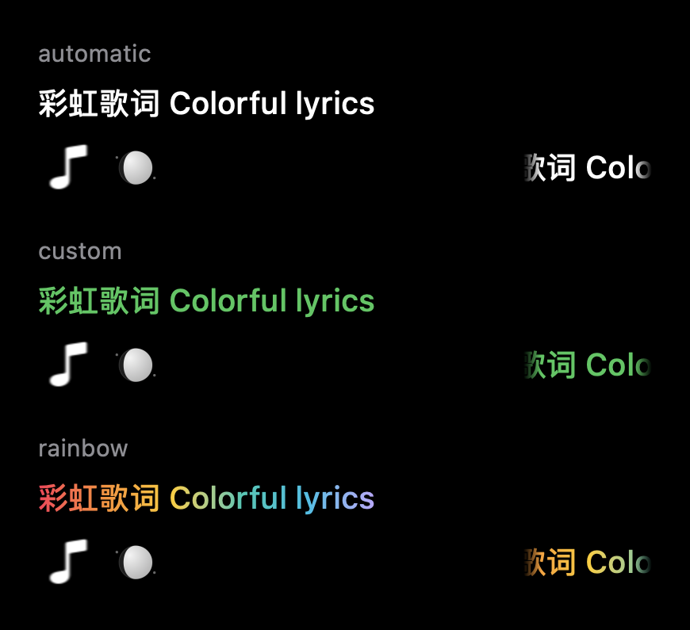

<p align="center">
  
</p>
<h1 align="center">Interesting Notch</h1>
<p align="center"><strong>音乐有色彩，任务有动静。</strong><br>让 macOS 顶部的一小块空间，容纳歌词、任务与日常状态。</p>

<p align="center">
  <a href="https://github.com/xyzxyq/Interesting.Notch/releases/latest"></a>
  
  
  <a href="LICENSE"></a>
</p>
<p align="center">
  <a href="https://github.com/xyzxyq/Interesting.Notch/releases/download/v3.0.10/interesting-notch-3.0.10-arm64.dmg"><strong>下载 3.0.10</strong></a> &nbsp;·&nbsp;
  <a href="docs/releases/3.0.10.md">更新日志</a> &nbsp;·&nbsp;
  <a href="docs/guide.md">使用指南</a> &nbsp;·&nbsp;
  <a href="https://github.com/xyzxyq/Interesting.Notch/issues">反馈问题</a>
</p>

<p align="center"></p>
<p align="center"><sub>原生组件演示：任务执行、尾焰熄灭与结束彩带。</sub></p>

## 一个灵动岛，几种日常

| 听音乐 | 看任务 | 处理日常 |
| :--- | :--- | :--- |
| 逐句滚动歌词、封面与昼夜日月装饰 | Codex 运行化作火箭，待回答问题化作水滴 | 音量、亮度、充电状态自然接入当前布局 |
| 自选歌词颜色，或使用彩虹渐变 | 展开查看问题、选项、模型与剩余额度 | 保留上游音乐控制、文件暂存与日历能力 |
| 黑、白、彩色水波，以及涟漪、星尘、流星、光雾 | 所有运行任务结束后，尾焰熄灭并播放彩带 | 可选纸飞机指针，提供大小调节与恢复入口 |

基于 [TheBoredTeam/boring.notch](https://github.com/TheBoredTeam/boring.notch) 二次开发，由 [xyzxyq](https://github.com/xyzxyq) 维护。**这是独立衍生项目，不是上游或 OpenAI 的官方版本。**

## 3.0.10 · Super Rocket 🚀

这一版围绕流畅度、个性化和减少重复计算展开。

- **歌词有了新配色。** 自动原配色、自选单色、彩虹渐变，支持设置预览与自动保存；正常模式 35 FPS，低电量模式 15 FPS。
- **水波拐角更圆滑。** 黑、白、彩色水波及涟漪使用连续曲线路径，保留原有颜色与强弱响应。
- **状态过渡更连贯。** 音量、亮度及充电提示与当前灵动岛布局一起变化，减少突兀切换。
- **常驻桥接改用 Swift。** 日常运行不依赖 Python；减少无效唤醒，关闭 Codex 功能或屏幕休眠时暂停应用端查询。
- **复用已经算好的内容。** 缓存歌词绘制、几何系数与固定角度数据，彩虹不增加独立动画定时器。

[完整更新说明](docs/releases/3.0.10.md) · [构建与验证](docs/releases/3.0.10-validation.md)

## 看见变化

<table>
<tr>
<td width="50%" valign="top">
<h3>水波与流星</h3>

<p>音乐边缘提供七种风格。水波的拐角更平滑，仍保留各圈颜色和传播节奏。</p>
</td>
<td width="50%" valign="top">
<h3>提醒落成水滴</h3>

<p>多个待回答请求合并呈现；展开后选择选项或输入回复，收到确认后提醒消散。</p>
</td>
</tr>
</table>

### 给歌词一点颜色

<p align="center"></p>

在 **设置 → 媒体 → 滚动歌词字体颜色** 中选择。渐变附着在文字上，随歌词一起滚动；当前句、退场文字和歌词粒子共用所选配色，封面及日月装饰保持原样。

<details>
<summary><strong>更多细节：火箭、燃油与纸飞机</strong></summary>

<p></p>

思考强度影响尾焰与速度效果；仍有任务运行时，火箭与提醒水滴可同时显示。

<p></p>

燃油表示剩余额度，不是 token 输出速度。Plus 优先展示 5 小时额度，Pro 及以上优先展示周额度。

<p></p>

纸飞机是默认关闭的实验性选项：替换普通箭头，大小可在 75%–175% 之间调整。依赖私有系统接口，兼容范围及恢复方式见[使用指南](docs/guide.md#纸飞机指针实验性)。

</details>

<sub>以上图片由项目原生 SwiftUI / Canvas 组件生成，使用演示状态及模拟音乐能量，并非桌面录屏。它们展示绘制效果，不作为真实任务、音频响应或跨应用兼容性的验证依据。GIF 可通过 <code>./scripts/render-readme-demos.sh</code> 重建。</sub>

## 安装与开始使用

1. 下载 [3.0.10 Apple Silicon 安装包](https://github.com/xyzxyq/Interesting.Notch/releases/download/v3.0.10/interesting-notch-3.0.10-arm64.dmg)，退出旧版。
2. 打开 DMG，将 `Interesting Notch.app` 拖到 `Applications`，再从应用程序文件夹打开。
3. 在 **设置 → 媒体** 选择“自动跟随正在播放的应用”，开启滚动歌词，并选择字体颜色和音乐边缘效果。

**系统要求：Apple Silicon（M 系列）· macOS 14 或更新版本。** 当前没有 Intel 安装包。

> **关于签名**：安装包使用本地开发证书签名，尚未经过 Apple Developer ID 公证。首次打开可能被 macOS 阻止；请核对下载来源，再使用系统提供的“仍要打开”入口。Release 提供 `SHA256SUMS.txt` 供校验。

3.0.7 及以后的版本可在设置中检查更新；自动下载安装由用户选择，默认关闭。3.0.6 及更早版本需要手动升级一次。内部标识仍沿用上游，不建议与上游原版同时运行；Debug 使用独立的 Preview 标识。

### 开启 Codex 联动

下载可选的 [原生桥接附件](https://github.com/xyzxyq/Interesting.Notch/releases/download/v3.0.10/interesting-notch-3.0.10-codex-bridge.zip)，解压后在该目录执行：

```bash
python3 scripts/codex-notch-bridge-install.py --binary ./codex-notch-bridge
```

Python 3 只用于这一步安装；附件已包含 arm64 Swift 可执行文件，无需自行编译。安装成功后，在应用的媒体设置中开启 Codex 模式。桥接通过当前用户的 LaunchAgent 自动运行，安装前校验签名并试运行，启动失败会恢复旧配置。**已安装旧 Python 桥接的用户也需执行此步骤，才能迁移至原生版；应用内更新不会替你更新桥接。**

桥接读取本机 Codex 任务状态、待回答问题与额度，通过带令牌保护的回环接口发送回答；需要完整核对的批准类请求仍在 Codex 中处理。清空提醒只隐藏本地提示，不会回答问题或取消任务。客户端私有接口变化可能影响兼容性。

### 播放器与权限

| 项目 | 支持范围 / 用途 |
| :--- | :--- |
| Apple Music、网易云音乐 | 使用系统播放信息同步歌词；网易云 3.1.9 曾在本机验证 |
| 其他播放器 | 需提供歌名、歌手、时长和播放进度；QQ 音乐、酷狗尚未专项验证 |
| 歌词来源 | 本地缓存、LRCLIB、网易云及手动 LRC 导入；逐句同步，不是逐字歌词 |
| 辅助功能 | 替换系统音量、亮度等 HUD；按需授权 |
| 录屏与系统录音、日历等 | 音频响应及对应功能按需申请；不授权音频捕获仍可使用普通动效 |

自动匹配不准确时，使用 **“选择或导入歌词…”** 预览候选或导入 LRC，选定后会记住。详细匹配规则、缓存位置、权限处理与指针恢复方法见[使用指南](docs/guide.md)。

## 从源码构建

开发工具要求：**macOS 15.6+、Xcode 26+**；应用部署目标为 macOS 14。

```bash
git clone https://github.com/xyzxyq/Interesting.Notch.git
cd Interesting.Notch
open boringNotch.xcodeproj
```

等待 Swift Package Manager 解析依赖，选择 `boringNotch` scheme，配置自己的签名身份，按 `⌘R` 运行。工程名和部分内部标识保留上游名称，以保持设置与授权兼容。

<details>
<summary><strong>开发与性能资料</strong></summary>

- [原生桥接：方案、接口与验证](docs/native-codex-bridge.md)
- [HUD 与文字绘制优化](docs/performance-2026-09-20.md)
- [几何、歌词定位与后台查询优化](docs/performance-round2-2026-09-20.md)
- [水波拐角与离屏渲染对照](docs/water-corner-smoothing-2026-09-20.md)
- [签名更新通道与发布流程](docs/automatic-updates.md)

性能记录区分现场观察、独立计算基准和离屏绘制；它们不能直接推导整机 CPU 降幅或续航提升。未测量整机功耗。常驻桥接迁移为 Swift，构建、安装和测试工具继续使用 Python。

</details>

## 贡献与致谢

问题请提交至[本仓库 Issues](https://github.com/xyzxyq/Interesting.Notch/issues)，附上 macOS 版本、应用版本和复现步骤；贡献说明见 [CONTRIBUTING.md](CONTRIBUTING.md)。本 fork 的安装包与更新通道独立于上游。

感谢 [Boring Notch](https://github.com/TheBoredTeam/boring.notch) 及其贡献者提供窗口、音乐控制、文件暂存、日历与 HUD 基础；感谢 [LyricsX / LyricsKit](https://github.com/ddddxxx/LyricsX)、[MediaRemoteAdapter](https://github.com/ungive/mediaremote-adapter) 与 [NotchDrop](https://github.com/Lakr233/NotchDrop) 的开源工作。上游原始图标由 [@maxtron95](https://github.com/maxtron95) 设计，网站由 [@himanshhhhuv](https://github.com/himanshhhhuv) 设计；本 fork 使用另行制作的蓝白笑脸图标。

本项目采用 **[GNU GPL v3](LICENSE)**，保留上游及第三方版权声明。歌词相关参考与 MPL-2.0 声明见 [THIRD_PARTY_NOTICES.md](THIRD_PARTY_NOTICES.md)，其他依赖许可见 [THIRD_PARTY_LICENSES](THIRD_PARTY_LICENSES)。
