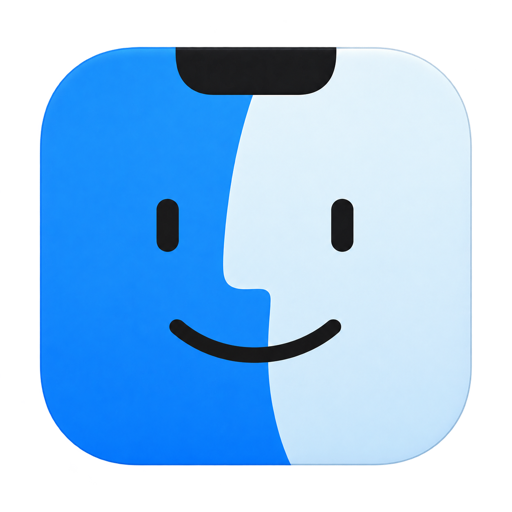
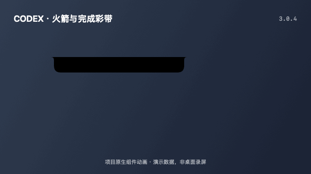
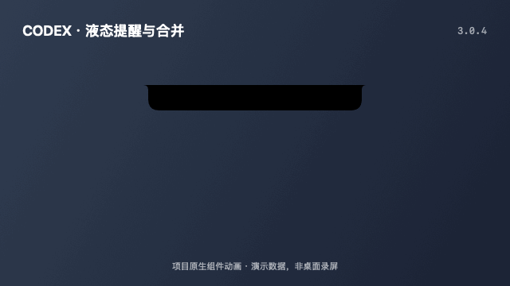
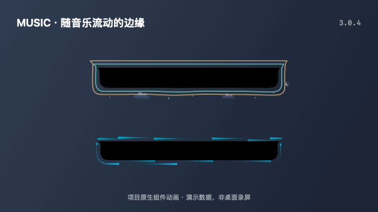
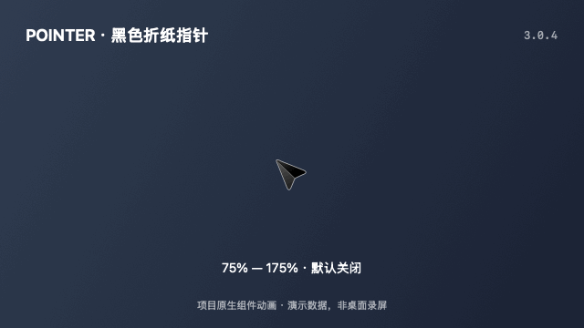
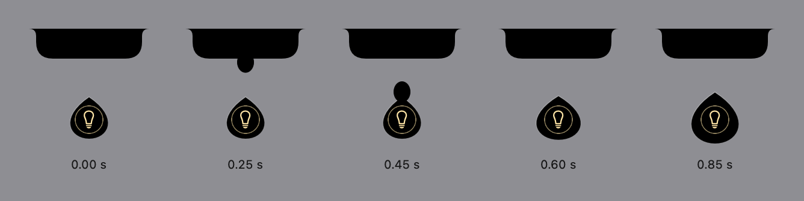
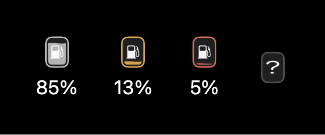

<p align="center"></p>

<h1 align="center">Interesting Notch</h1>
<p align="center">让 macOS 灵动岛呈现音乐、Codex 任务与日常状态。</p>

<p align="center">
  <a href="https://github.com/xyzxyq/Interesting.Notch">本项目</a> ·
  <a href="https://github.com/TheBoredTeam/boring.notch">上游 Boring Notch</a> ·
  <a href="LICENSE">GPL-3.0</a>
</p>

## 项目来源

**Interesting Notch 是基于 [TheBoredTeam/boring.notch（Boring Notch）](https://github.com/TheBoredTeam/boring.notch) fork 后进行二次开发的独立衍生项目，由 [xyzxyq](https://github.com/xyzxyq) 维护。**

原项目及其贡献者提供了灵动岛窗口、音乐控制、文件暂存、日历与系统 HUD 等基础能力。本仓库在这些工作的基础上，继续开发 Codex 状态联动、火箭与液态水滴动画、音乐边缘动效、歌词展示以及相关稳定性修复。感谢上游作者和所有贡献者。

本项目不是 TheBoredTeam 的官方版本，也不是 OpenAI 的官方产品。此 README 描述本 fork；上游的安装包、Homebrew 配方、社区与构建状态不代表本版本。

## 下载与安装

当前版本：**3.0.4（build 304）** · [更新说明](docs/releases/3.0.4.md) · [Release 页面](https://github.com/xyzxyq/Interesting.Notch/releases/tag/v3.0.4)

1. 下载 [Apple Silicon 安装包](https://github.com/xyzxyq/Interesting.Notch/releases/download/v3.0.4/interesting-notch-3.0.4-arm64.dmg)。
2. 退出旧版，打开 DMG，将 `Interesting Notch.app` 拖到 `Applications` 图标；应用会复制到系统 `/Applications` 文件夹。
3. 在设置 → 媒体中选择“自动跟随正在播放的应用”，开启“右侧滚动歌词”。

安装包仅支持 Apple Silicon（M 系列芯片），最低部署目标 macOS 14，未提供 Intel 包。DMG 仅展示应用和 `Applications` 拖拽目标；Release 同时提供 `SHA256SUMS.txt` 与可选的 `interesting-notch-3.0.4-codex-bridge.zip` 附件。

**本安装包使用本地开发证书签名，尚未经过 Apple Developer ID 公证。** 首次打开可能被 macOS 阻止，请在核对来源后使用系统提供的“仍要打开”入口。内部标识暂沿用上游，不建议与上游原版同时运行；测试版使用独立的 Preview 标识。

## 本版本的主要改动

| 功能 | 表现 |
| --- | --- |
| 任务结束彩带 | 桥接确认所有运行任务结束后，尾焰熄灭，再播放 1.5 秒的分层彩带与彩纸；等待输入、断线或状态丢失不会当作完成。 |
| Codex 火箭状态 | 执行任务时将灵动岛呈现为火箭，尾焰与速度效果随思考强度变化。 |
| 交互提醒水滴 | 等待用户交互时显示水滴；展开后可直接选择异步问题的选项，或输入文字并回车回复。收到 Codex 确认后对应提醒粒子消散；支持收起和清空本地提醒。 |
| 额度与模型信息 | 以燃油表现剩余额度；展开栏显示额度、模型名称及思考强度。Plus 优先展示 5 小时额度，Pro 及以上优先展示周额度。 |
| 音乐与歌词 | 支持 Apple Music 与网易云的紧凑歌词，提供多源获取、本地缓存、候选预览和 LRC 导入；播放、暂停及退出播放器时衔接音乐布局。 |
| 权限与稳定性 | HUD 使用主程序的辅助功能权限；音频响应在后台先检查权限，并提供显式授权与重连入口。 |

Codex 信息由本机桥接脚本读取，包括待回答问题的题目和选项；回答通过受令牌保护的本机接口送回原任务。提交失败会保留提醒。收起保留未回答问题，清空只隐藏本地提醒，不代替回答或取消任务。需要完整核对的批准类请求仍在 Codex 中处理。客户端私有接口变化可能影响兼容性。

## 效果展示

以下 GIF 由项目原生 SwiftUI／Canvas 组件逐帧生成，可在 GitHub README 中循环播放；使用演示状态和时间采样，**不是桌面录屏，也不证明真实任务、音乐或跨应用指针联动**。实际效果随设置、屏幕与“减少动态效果”选项变化。

### 任务结束：熄火 → 彩带



彩带阶段为 1.5 秒，包含长飘带、翻转彩纸与细小闪光。当前桥接确认的是运行回到空闲，不能区分成功、失败或取消；多个任务并行时，全部运行任务结束才触发。设置中只保留 Codex 模式开关与状态，已移除火箭／水滴预览按钮。

### 液态水滴：下落与融合



### 音乐边缘：彩色水波与流星



这里使用模拟能量展示绘制效果；真实播放时可选择音乐边缘风格，并搭配右侧滚动歌词、左侧封面及昼夜太阳／月球装饰。歌词来源和播放器兼容性见下文。

### 纸飞机：折面与尺寸



此图展示指针图像与缩放，不修改系统指针；实际功能为默认关闭的实验性选项，详见下文限制。

演示可通过 `./scripts/render-readme-demos.sh` 从源码重新生成。下面保留静态状态图供对照。

### 火箭与交互提醒

普通刘海随 Codex 执行状态过渡为黑色火箭；“高”及以上增加速度参照线，Ultra 使用更大的尾焰。需要用户确认时，火箭收回并显示可点击的灯泡水滴。

<p align="center"></p>

### 多个提醒合并

新水滴落下后与原水滴融合，合并后的水滴增大。点击水滴可查看多个待处理提示；处理完毕后，面板自动关闭，水滴回到灵动岛。

<p align="center"></p>

### 额度变成燃油

燃油图标表示剩余 Codex 额度，接近耗尽时改变颜色。播放音乐和不播放音乐时均可显示；它表示额度，不是实际 token 输出速率。

<p align="center"></p>

## 纸飞机指针（实验性）

在设置 → 外观 → 鼠标指针中开启“纸飞机指针”。普通箭头会换成黑色折纸轮廓，三个尖角采用圆滑过渡，搭配深色立体折面、细描边和机尖点击位置；大小滑块可在 75%–175% 之间调整；不修改文本光标、缩放指针或拖拽标记。功能默认关闭，无鼠标跟踪定时器，不需要新增权限。

关闭功能、正常退出、锁屏及休眠时恢复原箭头。异常退出后，恢复记录保留在应用的 Application Support/InterestingNotch/Pointer/originals.plist；下次启动会先恢复，再按开关状态应用。恢复失败时设置中会显示错误和重试按钮。恢复只覆盖仍属于本功能的图像，以避免覆盖其他指针主题工具后续的更改。

如果开启后只有 Dock 显示纸飞机，请检查系统设置 → 辅助功能 → 显示 → 指针中的自定义颜色。自定义颜色会绕过普通应用的箭头主题；新版在开启前检测此冲突，并提供前往系统设置的按钮。还原颜色会把系统指针改回黑色填充、白色描边；应用不会自动修改该系统设置。

此功能使用动态加载的私有 WindowServer 指针接口，受 macOS 版本和应用自定义指针影响，不保证所有应用都使用该主题。macOS 26 的 Arrow 与 ArrowS 必须成组写入后统一校验；仅检查接口返回成功不足以证明生效。构建和独立校验命令见 [实现与验证记录](docs/superpowers/plans/2026-09-12-paper-plane-pointer.md)。

## 源码构建

工程的最低部署目标为 **macOS 14**。源码构建沿用上游的工具要求：**macOS 15.6 或更新版本、Xcode 26 或更新版本**。不同系统版本的音频捕获和媒体能力可能存在差异。

1. 克隆本 fork：
   ```bash
   git clone https://github.com/xyzxyq/Interesting.Notch.git
   cd Interesting.Notch
   ```
2. 打开工程，等待 Swift Package Manager 解析依赖：
   ```bash
   open boringNotch.xcodeproj
   ```
3. 在 Xcode 选择 `boringNotch` scheme，配置自己的签名身份后按 `⌘R` 构建运行。

`Interesting Notch` 是当前项目展示名称。工程名、内部标识与部分开发构建名称暂时保留 `boringNotch` / `Interesting Notch Preview`，以避免重命名影响已有设置和授权。项目图标采用蓝白笑脸与顶部黑色刘海的设计。

如需查找本 fork 的发布包，请查看[本仓库 Releases](https://github.com/xyzxyq/Interesting.Notch/releases)，并核对对应提交及说明；不要使用上游下载链接来获取本 fork 的新增功能。

### 歌词获取与纠错

音乐来源选择“自动跟随正在播放的应用”（原 Now Playing），同步歌词不再限定 Apple Music；网易云音乐及其他提供 macOS Now Playing 信息的播放器共用这条歌词链路。播放器负责提供歌名、歌手、时长和播放进度，歌词仍来自本地缓存、LRCLIB／网易云或手动导入，并非直接提取播放器内显示的歌词。网易云音乐 3.1.9 已在本机验证。QQ 音乐、酷狗的专项适配与实机验证暂缓；不发布完整播放信息的客户端版本不能通过这条接口同步。

开启“媒体 → 右侧滚动歌词”后，优先读取本机保存的歌词；没有有效缓存时并行请求 LRCLIB 和网易云，收集通过歌曲版本和正文文字校验的结果，优先匹配专辑，再按固定来源顺序选择并保存（等待上限 12 秒）。一个来源失败不会阻断另一个来源。

自动匹配失败或歌词版本不正确时，打开“选择或导入歌词…”：可以修改歌曲与歌手关键词、预览候选并点击“使用并记住”，也可以导入 UTF-8 编码、带时间戳且小于 2 MB 的 LRC 文件。切歌后旧窗口的结果不能应用到新歌。“重新获取歌词”会跳过缓存重新自动匹配，成功后更新保存的结果。

缓存位于 `~/Library/Application Support/InterestingNotch/Lyrics`，按播放器、歌名、歌手、专辑和时长区分；手动选定的版本在后续播放中优先复用。外部歌词服务可能缺少记录或发生接口变化，目前仍为逐句同步，未引入逐字歌词格式。

中文标题及歌手信息的歌曲，自动匹配还要求存在足够的汉字歌词正文，署名行不计入；不能确认正文的拼音、译文或其他版本需手动选择。此规则是保守的文字校验，不是完整语言识别。中文名称的外语歌曲也可能需要手动选择，已手动保存的版本保持不变。旧规则的自动缓存会重新获取；显示语言仅控制中文简繁，不自动翻译原歌词。

### Codex 状态桥接

安装本机桥接需要 Python 3，以及可访问的本机 Codex 客户端环境。在仓库根目录执行：

```bash
python3 scripts/codex-notch-bridge-install.py
```

安装脚本会为当前用户注册 LaunchAgent，使桥接独立于终端运行。移除自动启动：

```bash
python3 scripts/codex-notch-bridge-install.py --uninstall
```

## 权限说明

| 功能 | 所需权限 |
| --- | --- |
| 替换音量、亮度等系统 HUD | 辅助功能 |
| 音乐动效跟随音频强弱 | 录屏与系统录音；不授权时仍可使用普通动效 |
| 日历、提醒事项等功能 | 按所用功能分别授权 |

请为实际运行的应用授权。开发版更换签名身份后，系统中已有的开关可能仍对应旧版本；如果开关已开但 HUD 仍提示授权，可在辅助功能列表中移除旧条目，再添加当前应用并重新授权。

持续开发时应保持签名身份与安装路径稳定。本仓库提供 [本机开发签名脚本](scripts/sign-development.py)，用于复用本地私有签名身份；它不会自动授予系统权限或安装证书信任，也不等同于 Apple Developer ID 公证发布。首次使用须自行配置对应的代码签名信任，签名私钥和钥匙串密码不得上传到仓库。

## 贡献与问题反馈

本 fork 的问题请提交到[本仓库 Issues](https://github.com/xyzxyq/Interesting.Notch/issues)，附上 macOS 版本、构建提交、复现步骤及相关日志。提交代码前可阅读 [CONTRIBUTING.md](CONTRIBUTING.md)；其中沿用的上游流程请结合本 fork 的实际情况使用。

## 许可与致谢

歌词的本地缓存、多源获取与手动纠错流程参考 [LyricsX](https://github.com/ddddxxx/LyricsX)。网易云适配参考其 LyricsKit 组件，相关来源、修改及 MPL-2.0 许可证说明见 [第三方声明](THIRD_PARTY_NOTICES.md)。

本项目保留上游的 **GNU GPL v3** 许可证，完整文本见 [LICENSE](LICENSE)。原项目与第三方代码的版权和归属声明予以保留，第三方许可见 [THIRD_PARTY_LICENSES](THIRD_PARTY_LICENSES)。

- [TheBoredTeam/boring.notch](https://github.com/TheBoredTeam/boring.notch)：本项目的上游基础。
- [MediaRemoteAdapter](https://github.com/ungive/mediaremote-adapter)：媒体播放信息适配。
- [NotchDrop](https://github.com/Lakr233/NotchDrop)：上游文件暂存功能的早期基础。
- [@maxtron95](https://github.com/maxtron95)：上游原始图标设计。本 fork 当前使用另行制作的蓝白笑脸图标。
- [@himanshhhhuv](https://github.com/himanshhhhuv)：上游网站设计。

纸飞机指针支持 75%–175% 大小调节：拖动时预览，松手后应用并保存；点击“默认”恢复 100%。尺寸与点击热点同步缩放，不修改 macOS 的系统指针大小设置。
