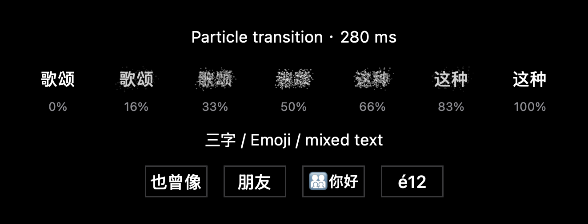

# 短语歌词验证记录

日期：2026-09-11。实现提交：`bf76020`，分支：`feature/compact-lyrics`。

工作树：`/Volumes/MySSD/PROJECT/InterestingNotch/Interesting.Notch/.worktrees/compact-lyrics`。

## 交付状态

代码实现已完成，保留开发分支，未合并 main、未推送。应用源文件新增两个，无新增第三方依赖，macOS deployment target 保持 14.0。设置路径：媒体 → Apple Music 右侧短语歌词，代码默认关闭。

Debug 测试版：`/tmp/interesting-notch-lyrics-build/Build/Products/Debug/boringNotch.app`。最终代码已完整构建并做本地 ad-hoc 签名；该签名用于本机测试，不是 Developer ID 签名或公证发布包。

验证机器：Mac17,3，macOS 26.6.2，Xcode 26.6（17F113）。未在 macOS 14 实机运行，因此不能把最低部署版本的构建配置当作旧系统运行验证。

## 已通过的检查

| 检查 | 证据和边界 |
| --- | --- |
| 基线构建 | 修改前 main 完整 Debug 构建成功，基线日志 `/tmp/interesting-notch-baseline.log` |
| 数据处理 | 两个指定中文样例、Character 守恒、三字上限、组合字符与 emoji、LRC 小数/多标签/offset/空行/坏时间、首句前与末句、半开时间区间、匹配歧义和时长容差、过渡时间检查通过 |
| 真实视图受控运行 | NSHostingView 使用生产 CompactLyricsView；按帧字节比较验证暂停不变、前后 seek、恢复跨片段、过渡完成后稳定、换歌重复 ID 不复用旧字、空歌词回退。测试窗口在屏幕外，不更改 Music 播放 |
| 粒子渲染 | 使用实际 LyricGlyph 和 Canvas 生成帧序列；每词 <=160 粒子，重复采样轨迹一致，减少动态效果不采样粒子；三字、emoji、中英混合渲染检查通过 |
| 最终应用 | xcodebuild 退出 0，`BUILD SUCCEEDED`；`codesign --verify --deep --strict` 退出 0 |

可复现数据检查：

```bash
xcrun swiftc -swift-version 5 boringNotch/models/CompactLyrics.swift scripts/CompactLyricsChecks.swift -o /tmp/interesting-notch-lyrics-checks
/tmp/interesting-notch-lyrics-checks
```

可复现离屏图像与受控运行检查（需要完整 Xcode，而非当前默认 Command Line Tools）：

```bash
DEVELOPER_DIR=/Applications/Xcode.app/Contents/Developer xcrun swiftc -swift-version 5 -D VISUAL_CHECKS boringNotch/models/CompactLyrics.swift boringNotch/components/Music/CompactLyricsView.swift scripts/CompactLyricsChecks.swift -o /tmp/interesting-notch-lyrics-visual-checks
/tmp/interesting-notch-lyrics-visual-checks
```

最终输出：

```text
Offscreen renderer: 120 frames, median 0.135 ms, p95 0.262 ms (not display FPS)
Visual checks passed; snapshot: /tmp/interesting-notch-lyrics-preview.png
Runtime checks passed: pause, forward/back seek, resume, song revision, fallback
CompactLyrics checks passed
```

这些时间只度量 ImageRenderer 的离屏帧生成路径，不包含实际屏幕合成、刷新调度、全应用负载，也不能证明真实显示达到 60 fps。

构建命令：

```bash
DEVELOPER_DIR=/Applications/Xcode.app/Contents/Developer xcodebuild -project boringNotch.xcodeproj -scheme boringNotch -configuration Debug -destination 'platform=macOS' -derivedDataPath /tmp/interesting-notch-lyrics-build -clonedSourcePackagesDirPath /tmp/interesting-notch-baseline/SourcePackages CODE_SIGNING_ALLOWED=NO build
codesign --force --deep --sign - /tmp/interesting-notch-lyrics-build/Build/Products/Debug/boringNotch.app
codesign --verify --deep --strict /tmp/interesting-notch-lyrics-build/Build/Products/Debug/boringNotch.app
```

## 真实应用观察

- 启动测试版，设置 → 媒体中已看到中文开关标题和说明；补充了明确的 accessibilityLabel 和 accessibilityHint。
- 首次只读检查时，Music 正在播放《老派约会之必要》；LRCLIB 精确请求返回 404，搜索返回 200/零候选。该歌曲没有被错误替换成其他搜索结果。
- 后续实际 Music 播放中，灵动岛右侧确实出现短语，并观察到连续换词；没有通过测试脚本改变播放、切歌或跳转。媒体来源为 Now Playing 时也正常按 Music bundle ID 启用此功能，不要求用户改成专用 Apple Music 控制器。
- 界面读回歌词开关 on；点击关闭后读回 off，右侧恢复频谱。最后一次读取时设置窗口和开关 on 再次可见，保留现场状态，未继续复位或退出正在使用的测试版。
- 初次启动传入 `-enableCompactLyrics YES`，该参数字符串不适合 Defaults 的 Bool 读写验证。已退出该进程，去掉开关覆盖后重新验证；生产实现不依赖此参数。
- 最后几处收尾改动（字色最低可见度、容器边界、频谱定时器清理）在最终构建中，正在运行的进程不自动热更新，需要重启测试版加载。

## 尚未完成的体验验收

慢歌、快歌、长间奏各 60 秒的真实歌曲同步体验与 Instruments 帧率/CPU 矩阵，多屏和旧 macOS 实机验证，实际播放器手动 seek/暂停/恢复的完整矩阵，以及人为延迟网络响应的切歌竞态注入，尚未执行。受控运行测试只验证显示层时序；请求 generation 防护经代码检查，未声称通过网络故障注入。

已知产品限制仍与设计一致：逐行歌词句内时间按字数推算；拖音可能提前消失；歌词源和专辑/版本精确匹配限制覆盖率；英文长词遵守三字符限制，因此可能不自然。没有准确同步歌词时保留频谱或用户原有 Lottie。

## 本次实现中的局部调整

1. Task 2 和 Task 3 的工程注册及静态接入合并为一个提交，以保持每个提交可构建；其余逻辑没有扩大范围。
2. 过渡时长函数在 Task 1 已实现，Task 4 为它补充边界断言，没有人为制造一次失败。
3. 频谱与歌词之间会反复销毁视图，因此为原有 AudioSpectrum 增加 deinit 定时器清理，防止被移除后的 Timer 留在 RunLoop。
4. 深色封面颜色使用 AppKit 与白色混合并固定不透明度，以维持短文字可见度，避免复用旧亮度函数在纯黑输入时除零。
5. 工作树中的 `._*` AppleDouble 文件保持未跟踪；未删除，也未纳入提交。


