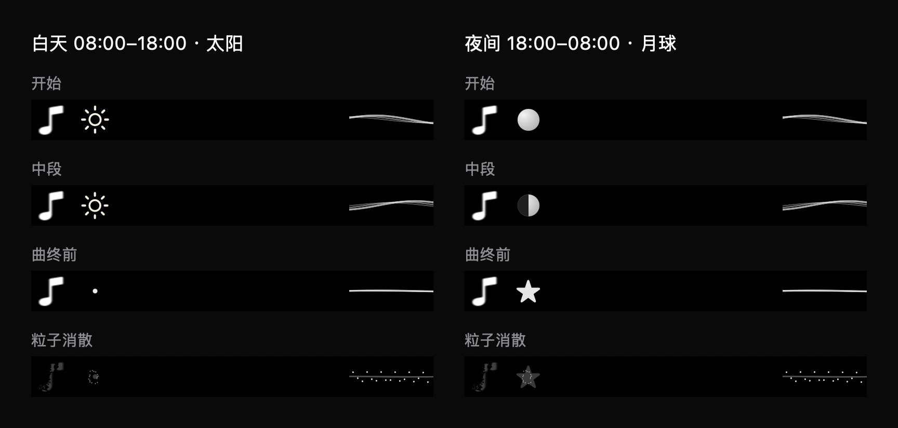

# 昼夜太阳与月球

系统本地时间 08:00（含）至 18:00（不含）显示太阳，其他时段显示月球。日历使用自动更新的本地时区；独立的一秒时间检查让暂停时仍可切换昼夜，SwiftUI 对昼夜混合值执行一秒淡入淡出，不重播整岛入场动画。

太阳使用浅金至橙金球面渐变、细微表面斑点、十二束缓慢变化的日冕和少量向外漂移的金色粒子。歌曲进度控制颜色与日冕长度；结束前 2.5 秒开始收束为光点，沿用原有提前粒子消散时机。月球效果保持原有行为。暂停时停止太阳运动，减少动态效果时保持静态纹理与光晕。

验证：07:59、08:00、17:59、18:00、午夜和 UTC+8 边界断言通过；原有歌词加载、时间轴、暂停/跳转和渲染检查通过。生产渲染器生成昼夜四阶段预览并查看。完整 Debug 构建成功，ad-hoc 签名及严格签名验证通过。未等待真实 08:00/18:00 边界做实机过渡验收；离屏渲染不代表屏幕帧率。

检查命令：

```sh
DEVELOPER_DIR=/Applications/Xcode.app/Contents/Developer xcrun swiftc -swift-version 5 -D VISUAL_CHECKS boringNotch/models/PlaybackState.swift boringNotch/models/CompactLyrics.swift boringNotch/components/Music/CompactLyricsView.swift scripts/CompactLyricsChecks.swift -o /tmp/lyrics-sun-checks
/tmp/lyrics-sun-checks
```

已按授权退出旧版并启动 `/tmp/interesting-notch-sun-build/Build/Products/Debug/boringNotch.app`。验证时系统时间为 2026-09-11 23:07 CST，真实应用应显示月球；下图白天列来自同一生产渲染器的受控输入，不是修改系统时间后的截图。


用户要求夜间先预览太阳后，增加仅 Debug 可用的 `--preview-sun` 启动参数；只影响本次进程，不写入偏好设置，不改变系统时间，Release 不包含此覆盖。完整构建与签名验证通过，已重启 `/tmp/interesting-notch-sun-preview-build/Build/Products/Debug/boringNotch.app` 并核对进程参数包含 `--preview-sun`。不带该参数重新启动即可恢复自动昼夜切换。

## 系统风格收敛

根据用户对违和感的反馈，太阳与星星改用 SF Symbols `sun.max` / `star.fill`，统一低饱和浅色。月球只保留柔和球面渐变、暗面和细轮廓，继续反映歌曲进度。移除月坑、流星、背景星点、金色切面、光晕及持续闪烁；粒子只用于既有切换和结束时刻，天体收尾粒子减至 16 个。太阳随进度轻微收小，曲终收束为光点，月球转星星的语义保留。

渲染预览、受控检查、完整 Debug 构建及严格签名验证通过。应用已重启至 `/tmp/interesting-notch-refined-build/Build/Products/Debug/boringNotch.app`，保留 `--preview-sun`。未宣称主观风格验收已通过，待用户观察。



## 播放进度与弧形月相

太阳增加细进度环：亮弧随歌曲已播放比例连续缩短，使用现有播放时钟并跟随暂停和跳转；太阳符号缩小以留出细环空间。月球明暗分界改为连续曲线，在播放中段仍保留弧度，是符合视觉需求的风格化月相。

月相起点、终点、中段曲率和单调变化检查通过，原有加载与暂停、跳转、收尾渲染检查通过；完整 Debug 构建及严格签名验证通过。已退出旧进程并启动 `/tmp/interesting-notch-celestial-progress-build/Build/Products/Debug/boringNotch.app`，核对新进程保留 `--preview-sun`。

## 波浪光芒太阳

按用户反馈移除外围进度环。中心为固定半径的实心圆，填充不透明度随播放比例从 1 降至 0，轮廓保持固定颜色和线宽。八束光芒的波幅随播放比例从 0.85 降至 0，长度从 4 缩短至 1.5；保持原有播放时钟、暂停和跳转语义。曲终保留空心轮廓直至既有粒子消散，不再提前收束为光点。

受控渲染已核对开始、中段、曲终前及粒子消散阶段；歌词加载和播放状态检查通过。

完整 Debug 构建和严格签名验证通过。应用已自动重启至 `/tmp/interesting-notch-sun-rays-build/Build/Products/Debug/boringNotch.app`，保留太阳预览参数。
