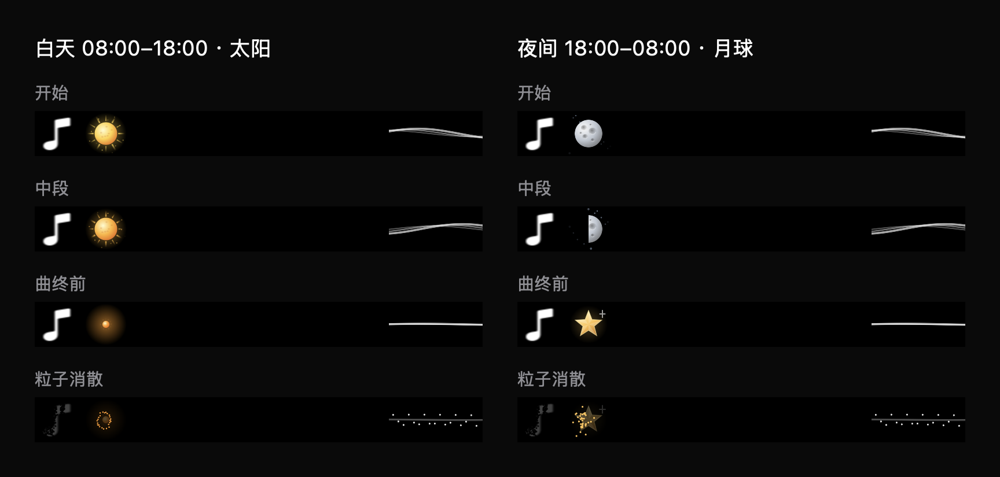

# 昼夜太阳与月球

系统本地时间 08:00（含）至 18:00（不含）显示太阳，其他时段显示月球。日历使用自动更新的本地时区；独立的一秒时间检查让暂停时仍可切换昼夜，SwiftUI 对昼夜混合值执行一秒淡入淡出，不重播整岛入场动画。

太阳使用浅金至橙金球面渐变、细微表面斑点、十二束缓慢变化的日冕和少量向外漂移的金色粒子。歌曲进度控制颜色与日冕长度；结束前 2.5 秒开始收束为光点，沿用原有提前粒子消散时机。月球效果保持原有行为。暂停时停止太阳运动，减少动态效果时保持静态纹理与光晕。

验证：07:59、08:00、17:59、18:00、午夜和 UTC+8 边界断言通过；原有歌词加载、时间轴、暂停/跳转和渲染检查通过。生产渲染器生成昼夜四阶段预览并查看。完整 Debug 构建成功，ad-hoc 签名及严格签名验证通过。未等待真实 08:00/18:00 边界做实机过渡验收；离屏渲染不代表屏幕帧率。

检查命令：

```sh
DEVELOPER_DIR=/Applications/Xcode.app/Contents/Developer xcrun swiftc -swift-version 5 -D VISUAL_CHECKS boringNotch/models/PlaybackState.swift boringNotch/models/CompactLyrics.swift boringNotch/components/Music/CompactLyricsView.swift scripts/CompactLyricsChecks.swift -o /tmp/lyrics-sun-checks
/tmp/lyrics-sun-checks
```

已按授权退出旧版并启动 `/tmp/interesting-notch-sun-build/Build/Products/Debug/boringNotch.app`。验证时系统时间为 2026-09-11 23:07 CST，真实应用应显示月球；下图白天列来自同一生产渲染器的受控输入，不是修改系统时间后的截图。


