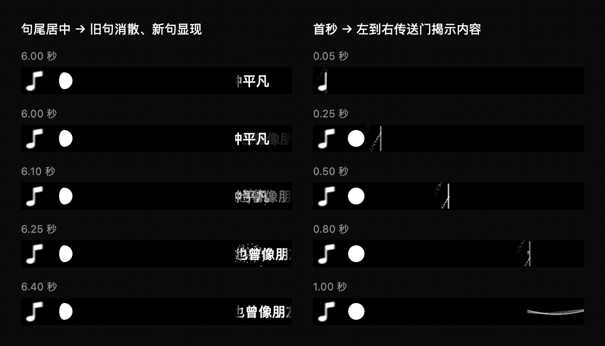

# 歌词加载恢复与切换动画

## 本次行为

- 每句滚动结束时，最后一个字的中心停在右侧视区中间。下一句按原时间戳进入，旧句剩余部分在 0.4 秒内消散为粒子，新句同时渐显，不延后换句时间。
- 歌曲播放的第一秒，传送门从整个灵动岛最左端移向最右端，逐渐揭示封面、月相与右侧内容。入场位置由歌曲播放时钟决定，暂停冻结，进度跳转重新计算；减少动态效果时使用淡入，关闭粒子。
- 没有手动重试按钮。设置只显示加载状态；重新打开歌词开关强制取消旧请求、清理旧结果，并重新请求当前歌曲。设置事件使用 force 刷新，避免快速关闭再打开后因读取到相同歌曲而跳过请求。

## 只有波浪的排查

现场 Music 正在播放鹿晗《勋章 Medals》，专辑《勋章 Medals - Single》，时长 215.954 秒。只有一个旧测试版主进程在运行，路径为 moon-build。

直接核对 LRCLIB：精确查询返回 200 且有同步歌词；同轮带专辑搜索返回 HTTP 503，不带专辑搜索返回 200。旧逻辑遇到请求错误直接结束，同一歌曲不再重试；搜索也始终携带专辑且严格匹配专辑文本。这些是已确认的脆弱路径，但未声称已定位用户每一次波浪显示的全部原因。

改动：

- 网络错误、429 和服务端错误自动有限重试，单阶段最多 3 次；精确查询、带专辑搜索、去掉专辑搜索逐级进行。
- 歌名和歌手统一简繁、全半角、大小写、空格及标点后比较，时长仍要求相差不超过 2 秒。优先同专辑；跨专辑只接受唯一歌词时间轴。完全相同的重复记录不算冲突，Live 等版本文字不会删除。
- 紧凑歌词直接请求同步歌词，不再先等待无法提供逐字进度的原生文本脚本。
- 忽略同歌不足 1 秒的时长元数据波动，避免不断清空和重发请求；成功、无结果及异常均受取消和 generation 检查保护。
- 设置区分加载中、就绪、未找到和请求失败，避免所有情况只能通过波浪猜测。

用生产 fetch 函数实测上述曲目：成功获取 30 个可用歌词片段，首句时间 27.03 秒，末句开始时间 199.38 秒。因此此歌前 27.03 秒的波浪属于当前歌词时间轴的预期行为。

## 验证

2026-09-11，最终完整 Debug 构建退出 0，`BUILD SUCCEEDED`；ad-hoc 签名及严格签名验证成功。新测试应用：

`/tmp/interesting-notch-transition-build/Build/Products/Debug/boringNotch.app`

未退出或替换用户正在运行的 moon-build。未合并主分支、未推送。

可复现检查：

```sh
DEVELOPER_DIR=/Applications/Xcode.app/Contents/Developer xcrun swiftc -swift-version 5 -D VISUAL_CHECKS boringNotch/models/PlaybackState.swift boringNotch/models/CompactLyrics.swift boringNotch/components/Music/CompactLyricsView.swift scripts/CompactLyricsChecks.swift -o /tmp/lyrics-transition-checks
/tmp/lyrics-transition-checks
```

已通过：503 后恢复、去专辑搜索、重复/冲突版本、重试上限、取消、末字居中数值检查；实际 NSHostingView 暂停/跳转/曲终回退、换句消散暂停冻结与完成、首秒揭示暂停冻结与完成。开关强制刷新和 generation 防护经代码路径检查，未做完整应用网络竞态注入。生产 Canvas 预览已人工查看。

离屏 120 帧：中位数 0.101 ms、p95 0.143 ms；不代表实际屏幕帧率。仍依赖歌词源覆盖率及录音版本匹配，无法保证每首歌都有同步歌词。逐字同步、未标注伴奏识别没有新增能力。



## 入场速度后续调整

此前一秒包含穿过物理刘海的不可见距离，两侧各只有约 0.21 秒可见动画（54/150/54 预览布局）。现改为将一秒分配给两侧可见区域：左侧 0–0.5 秒、右侧 0.5–1 秒，跳过物理刘海的距离。暂停与减少动态效果的行为保持不变。

新增 0%、25%、50%、75%、100% 揭示位置断言，完整受控检查通过；更新后的生产渲染预览已查看。完整 Debug 构建和严格 ad-hoc 签名验证通过。此调整的测试应用为 `/tmp/interesting-notch-entry-build/Build/Products/Debug/boringNotch.app`。

用户后续将总时长延长至两秒：当前实现为左侧 0–1 秒、右侧 1–2 秒。受控检查、完整构建及签名验证通过；最新测试应用为 `/tmp/interesting-notch-entry2-build/Build/Products/Debug/boringNotch.app`。

## 新句从右侧滑入

新句起点移至右侧视区右边缘，使用 0.35 秒三次缓出位移接上原有滚动；与旧句 0.4 秒粒子消散同时进行，末字仍停在右侧中央。减少动态效果时保留原有分段显示。新增句首边界与 0.1 秒入场像素检查，修正裁切图像比较中计入行缓冲填充字节的问题；全部受控检查、完整构建和签名验证通过。生产预览已查看。按用户授权退出旧进程，并启动 `/tmp/interesting-notch-slide-build/Build/Products/Debug/boringNotch.app`。
