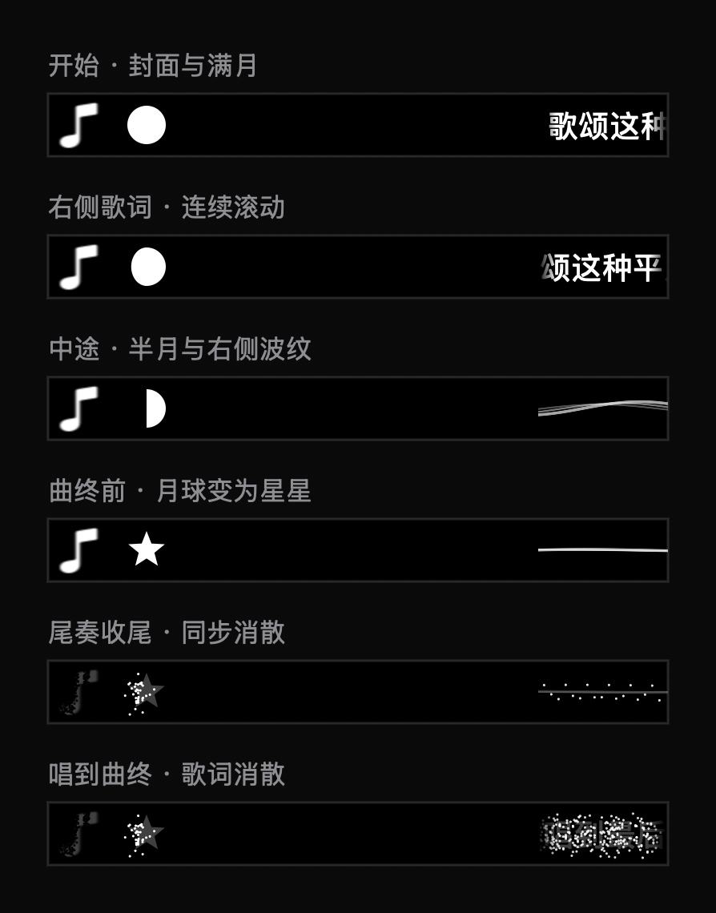

# 右侧歌词与进度月球

本次用户要求取代双侧传送门设计。左侧固定封面与进度月球，右侧滚动歌词或伴奏波纹。系统中文简繁转换保持启用。

## 行为

- 月相由实际播放位置/歌曲时长确定：开始满月、中间半月、后半段月牙，结束前 2.5 秒开始过渡为星星，暂停冻结、拖动立即更新。
- 封面、星星与右侧歌词/波纹在结束前 1.2 秒同步粒子消散，提前 0.2 秒结束，以给连续播放留出空间。
- 移除每字 0.4 秒的歌词结束估算。每句按 LRC 起始时间显示，持续到下一句或明确空白时间戳；最后一句持续到歌曲结束。未标注的间奏不再通过字数猜测。
- 取消歌词从屏外滑入/滑出的时间。首字在句子起始时刻已可见，只将溢出右侧视区的部分匀速滚动；短句无需移动。
- Now Playing 时钟兼容带小数秒的 ISO 时间戳；仅暂停/恢复/变速的增量消息重新建立位置与参考时间，避免暂停时间计入播放进度。此处修正来自代码检查，不代表已经证实是用户实听错位的全部原因。
- 设置新增「歌词时间微调」，范围 ±10 秒、步长 0.1 秒，正值提前、负值延后。微调仅作用于歌词，不改变月球进度与曲终收尾时机。

## 验证

2026-09-11 完整 Debug 构建成功；本地 ad-hoc 签名及严格签名验证成功。应用：`/tmp/interesting-notch-moon-build/Build/Products/Debug/boringNotch.app`。未替换用户正在运行的旧版，未推送或合并主分支。

可复现检查：

```sh
DEVELOPER_DIR=/Applications/Xcode.app/Contents/Developer xcrun swiftc -swift-version 5 -D VISUAL_CHECKS boringNotch/models/PlaybackState.swift boringNotch/models/CompactLyrics.swift boringNotch/components/Music/CompactLyricsView.swift scripts/CompactLyricsChecks.swift -o /tmp/moon-lyrics-checks
/tmp/moon-lyrics-checks
```

已通过：简繁转换、长音不按字数截断、相邻句边界、正负偏移、毫秒/整秒时间戳、暂停与恢复锚点、元数据更新保持锚点、歌词不泄漏到左侧、句首立即可见、暂停/恢复滚动、前后拖动、曲终回退和波纹回退。生产 Canvas 六阶段预览已检查。

离屏 120 帧中位数 0.085 ms、p95 0.179 ms，不代表屏幕实际帧率。

## 未验证与限制

此次只读媒体适配器查询返回 null，没有可用实时曲目；已请求用户提供错位曲目用于实听比对。不能宣称真实歌曲已实现逐字同步。当前歌词源提供逐行时间戳，句内滚动仍为线性近似；固定偏移可微调，但逐句时间错误、不同录音版本、未标注的拖音与间奏不能由全局偏移消除。


