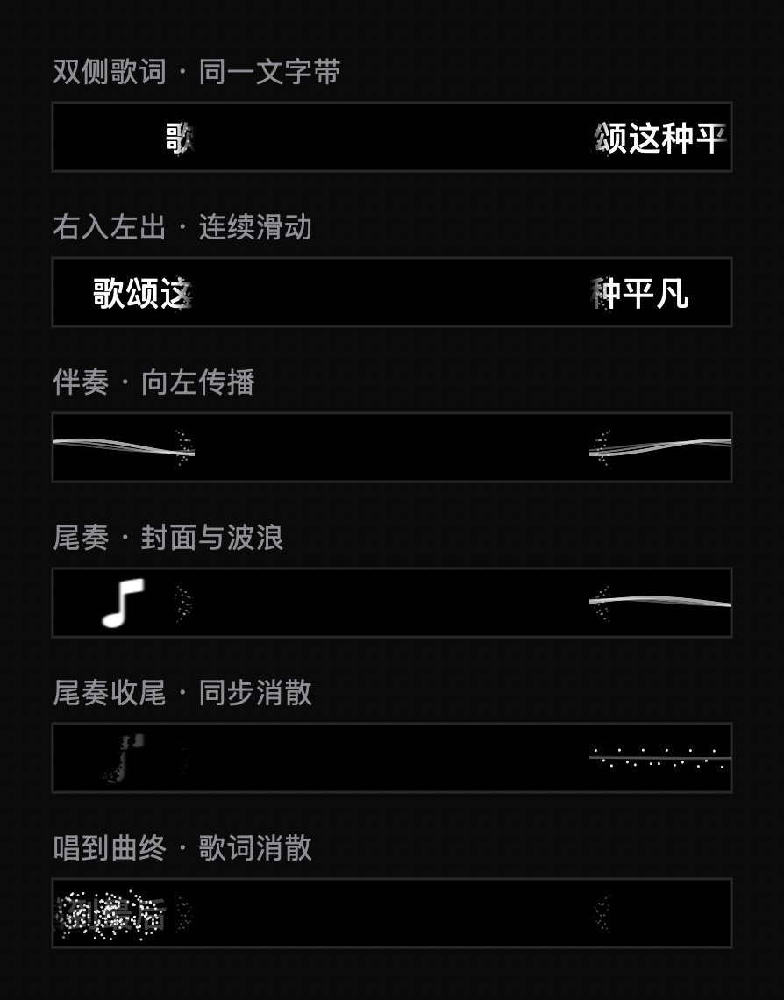

# 双侧传送门歌词：实现与验证

本记录取代此前三字短语方案的当前行为说明；旧验证记录仅描述旧版。

## 已批准并实现的行为

- 开启「媒体 → Apple Music 双侧流动歌词」后，整句歌词从右向左穿过两个视区。逻辑文字带跳过物理刘海，边缘遮罩和粒子传送门衔接两侧。
- 伴奏显示向左传播的双侧波浪；波浪是视觉动画，并非音频振幅分析。
- 伴奏尾奏最后约 5 秒左侧显示封面，右侧波幅递减；距结束 1.2 秒开始同步消散，提前 0.2 秒完成。
- 仍在演唱的末句优先保持歌词，使用歌词粒子消散，不切换封面。切歌沿用请求 generation 防护，暂停冻结，拖动后按播放位置重新计算状态。
- 中文文本使用 Foundation 原生简繁转换：系统首选语言为简体中文时转简体，繁体中文时转繁体，其他语言保留原文。转换覆盖原生歌词、网络逐行歌词和展开歌词，仅作用于显示，不改变歌曲检索元数据，也不翻译外语。

实际读取本机 AppleLanguages 为 `zh-Hans-CN`。保留原有开关存储键，无新增依赖，部署目标保持 macOS 14。

## 验证证据

2026-09-11，完整 Debug 构建退出 0，`BUILD SUCCEEDED`。新应用路径：

`/tmp/interesting-notch-portal-build/Build/Products/Debug/boringNotch.app`

本地 ad-hoc 签名与 `codesign --verify --deep --strict` 均成功；不是公证发布包。未替换正在运行的旧测试版。

可复现检查（在开发工作树执行）：

```sh
DEVELOPER_DIR=/Applications/Xcode.app/Contents/Developer xcrun swiftc -swift-version 5 -D VISUAL_CHECKS boringNotch/models/CompactLyrics.swift boringNotch/components/Music/CompactLyricsView.swift scripts/CompactLyricsChecks.swift -o /tmp/portal-lyrics-visual-checks
/tmp/portal-lyrics-visual-checks
```

输出：

```text
Portal offscreen renderer: median 0.093 ms; p95 0.204 ms (not display FPS)
Portal runtime checks passed: pause, scroll, forward/back seek, ending rewind, wave fallback
Portal lyrics checks passed: Chinese script, LRC, full lines, instrumental/sung endings, seek, matching
```

检查包括 Hans、Hant、香港语言标识、英文原文保留、emoji，完整句子时间轴、两种收尾和提前消散。NSHostingView 受控运行比较实际渲染字节，验证暂停、恢复滚动、前后跳转、结束后回退与无歌词波浪。生产渲染器生成的六状态预览已检查，覆盖双侧滚动、波浪、封面尾奏及两类消散：



## 体验边界

普通 LRC 通常只有每句开始时间；没有明确空行时间戳时，当前按字数估计演唱结束。因此拖音、短歌词长尾音可能误判伴奏；精确识别需要逐字或人声结束时间戳。没有同步歌词时使用双侧波浪，不伪造歌词或尾奏时间。

时间线请求每秒最多 60 次刷新；离屏渲染耗时不等于实际屏幕帧率。新版尚未完成真实歌曲长时间播放、跨曲衔接、不同屏幕及 macOS 14 实机体验验收。减少动态效果时使用静态波浪与分段文字位移，并关闭粒子。
