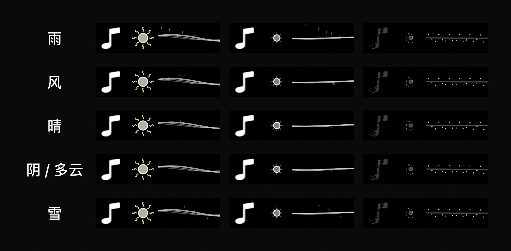

# Open-Meteo 天气波浪

新增雨、风、晴、阴/多云、雪五种低密度 Canvas 动效。雨滴和微涟漪、风线和小叶片、暖色微粒、灰白微粒、细雪使用歌曲时钟，暂停冻结；天气变化用一秒交叉淡入淡出。四时段控制波浪色调和波幅；歌词即将开始的 0.3 秒内天气粒子淡去，歌词状态不绘制天气粒子。系统减少动态效果时停用持续天气粒子。无歌词时也在曲终收敛波浪，复用现有 2.5 秒天体转换和提前粒子消散。

## 获取与设置

- 新增“天气波浪动效”开关，默认关闭。开启后申请系统定位；也可搜索城市并从结果中选择，固定城市优先。
- Open-Meteo forecast 查询 current weather_code、wind_speed_10m，明确使用 m/s 和 Unix 时间。雨雪优先于风；无降水且风速 >= 5.5 m/s 显示风，此阈值仅为装饰映射，不是气象预警。
- 未知天气代码不猜测，回退普通波浪。每 15 分钟刷新，缓存最多两小时；失败保留新鲜缓存，切换城市清除旧天气。关闭取消任务并清空显示，重新开启主动请求；歌词开关重新打开也触发天气刷新。
- 城市搜索 400 ms 防抖，最多五项；任务取消和 generation 检查防止旧结果覆盖新城市。位置请求为公里级，坐标四舍五入至两位小数。定位拒绝时清空当前定位显示并提示选城市。
- 来源及署名链接在设置页。无需 Apple Developer Program 或 API key；Open-Meteo 免费托管接口面向非商业用途。

来源：https://open-meteo.com/en/docs 、https://open-meteo.com/en/docs/geocoding-api 、https://open-meteo.com/en/pricing 。数据源不同于 Apple Weather，不承诺与系统天气一致。

## 验证

`WeatherChecks.swift` 验证 WMO 映射、风速单位、坐标验证、畸形响应、缓存过期和序列化。使用公开北京坐标完成真实城市搜索及当前天气解码；没有将测试城市设为用户应用地点。

`WeatherManagerChecks.swift` 使用 URLProtocol 验证开启加载、关闭清空、503 保留缓存、换城市隔离、重新打开重载、关闭后晚到结果不恢复显示。

现有歌词加载、暂停、跳转、入口动画与收尾检查通过；生产 Canvas 生成五天气三阶段预览并检查。完整 Debug 构建及严格 ad-hoc 签名验证通过；Info.plist 中定位用途说明已验证。已退出旧应用并重启 `/tmp/interesting-notch-weather-build/Build/Products/Debug/boringNotch.app`，保持系统时间自动切换。

首次启用后的真实定位授权和本机位置天气尚待用户操作确认；离屏预览不是实机天气或帧率验证。

```sh
export DEVELOPER_DIR=/Applications/Xcode.app/Contents/Developer
xcrun swiftc -swift-version 5 boringNotch/models/NotchWeather.swift scripts/WeatherChecks.swift -o /tmp/weather-checks
/tmp/weather-checks --live
xcrun swiftc -swift-version 5 boringNotch/models/NotchWeather.swift boringNotch/managers/NotchWeatherManager.swift scripts/WeatherManagerChecks.swift -o /tmp/weather-manager-checks
/tmp/weather-manager-checks
xcrun swiftc -swift-version 5 -D VISUAL_CHECKS boringNotch/models/PlaybackState.swift boringNotch/models/CompactLyrics.swift boringNotch/models/NotchWeather.swift boringNotch/managers/NotchWeatherManager.swift boringNotch/components/Music/CompactLyricsView.swift scripts/CompactLyricsChecks.swift -o /tmp/lyrics-weather-checks
/tmp/lyrics-weather-checks
```



## 定位失败与手动选城可见性修复

实机 locationd 日志确认客户端已授权，随后返回 location unavailable 并超时，不能归因于用户未授权。临时定位失败改为 60 秒重试，状态明确说明系统暂未返回位置；拒绝定位单独提示并清除旧定位天气。

城市输入框在 grouped Form 中改为独立 VStack、roundedBorder、显式 prompt、labelsHidden 和全宽布局，并增加输入提示、搜索中状态、带“选择”的结果行。生产设置视图的 NSHostingView 渲染检查确认原生 NSTextField 可编辑且宽度大于 200；人工核对预览，缓存/开关检查、完整构建和签名验证通过。系统定位恢复仍取决于 macOS 是否能取得位置，未声称定位已恢复。
