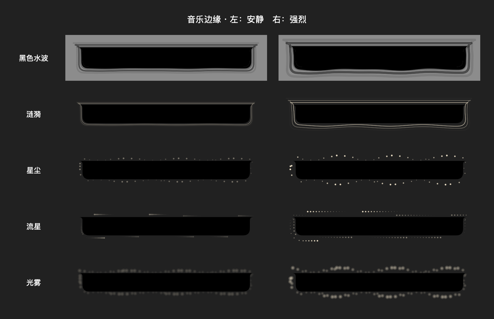

# Black water perimeter — 2026-09-12

Added 黑色水波 (`water`) to Media → 音乐边缘动效. The outside black silhouette undulates and three dark wavefronts travel outward and fade. A faint neutral highlight gives dark wallpapers some contrast. Existing audio energy/phase, playback fades, settings and reduced-motion behavior are reused. The center remains masked; album artwork and lyrics do not deform. Existing four styles have larger particles/trails, higher opacity and more outward travel.

Canvas uses 24 points of transparent margin; the NSPanel now has matching extra width and bottom room, preserving the content dimensions and screen-top positioning. Expanded wave paths use rounded joins to avoid spikes at the notch shoulders. Strength is still user selectable. No new dependencies or audio-capture changes.

Validation:
- Added a black-perimeter rendering assertion first; it failed against the prior fallback particle rendering.
- Final MusicEdgeChecks passed: RMS attack/release, invalid audio, contour wrap, five intensity variants, black pixels outside the notch, transparent center, time-varying wave rendering, and reduced-motion invariance.
- Compare decoded pixels rather than PNG file bytes to avoid encoder metadata affecting rendering comparisons.
- Inspected synthetic production-view preview below; it is not a live app capture or a real audio synchronization test. The water row uses a lighter background to show black wavefronts.
- Debug xcodebuild: BUILD SUCCEEDED, /tmp/interesting-notch-edge-build. git diff --check passed.
- Ad-hoc codesign verified, installed to /Users/zxy/Applications/InterestingNotch Development.app and restarted after quitting the previous process. Existing selected style is preserved; select 黑色水波 in settings to view it.

