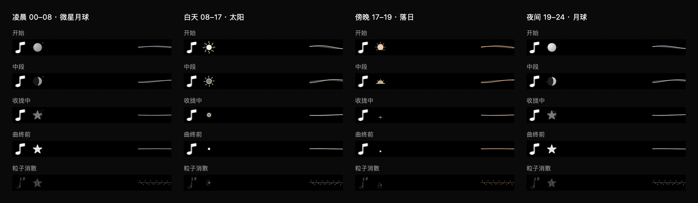

# Continuous celestial motion — 2026-09-12

Added slow rotation and travelling ray bends to the left sun, gentle floating and light modulation to the moon, two orbiting micro-lights, and subtle motion to sunset rays. Existing song-progress morphology and 2.5-second ending transformations remain. Lift and light modulation decay during the ending transformation. Motion uses the existing playback clock, freezes on pause and is disabled by Reduce Motion. No persistent ring around the sun or additional dependencies.

Validation: visual CompactLyricsChecks passed motion/reduced-motion/end-state assertions plus existing pause, seek, ending rewind, lyric entry and renderer checks. Inspected the synthetic four-period preview below. Full Debug xcodebuild, git diff --check and ad-hoc signature verification passed. Stable installed app replaced and restarted. Runtime playback was not manually paused or seeked for this update.

