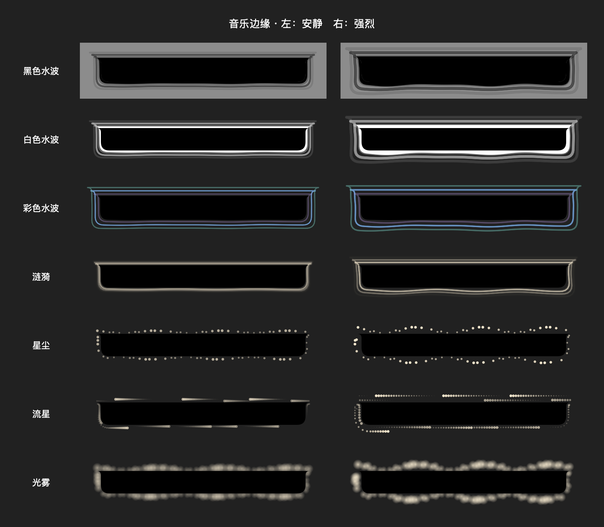

# Individually colored water rings — 2026-09-12

Replaced the shared rotating gradient with one stable solid color per emitted wave. Emission IDs cycle through muted blue, violet, rose, amber and teal; adjacent waves differ and each retains its assigned hue until fading out. Colored waves have thinner strokes and wider spacing with a subdued black inner edge. Black/white water and the other styles retain their rendering settings.

Validation: MusicEdgeChecks passed all seven styles and added checks for three distinct simultaneous ring colors, stable colors during travel and a new color on subsequent emission. Reduced-motion and interior-mask assertions also passed. Full Debug xcodebuild succeeded; git diff --check passed. Inspected synthetic production-view rendering below. Ad-hoc signing verified; installed at the stable application path and restarted. No live audio verification was performed in this visual-only change.

