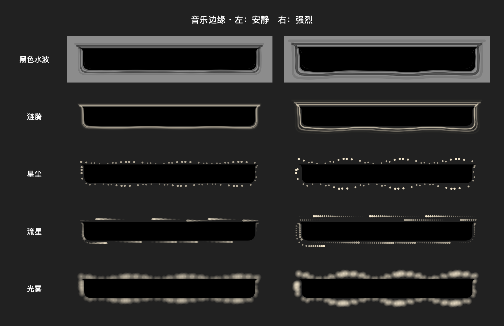

# Stronger existing perimeter effects — 2026-09-12

Raised the four original styles' baseline visibility (including unavailable/quiet audio). Ripple: 1.7-point primary stroke plus a 4-point soft rim, scaled by strength. Dust: 78 larger, brighter particles. Meteor: 11 heads and 24 tapered tail samples. Mist: 110 overlapping larger radial gradients. Base phase speed 0.65 instead of 0.4 for these four styles. Black water and audio capture remain unchanged. Retained reduced motion, interior masking and the three strength settings.

Validation: Debug xcodebuild succeeded; MusicEdgeChecks passed all five styles, energy response, interior mask, phase changes and reduced-motion checks; git diff --check passed. Inspected the synthetic low/high render below (not live audio capture). Ad-hoc signing verified, stable installed app replaced and restarted. User's existing selection and strength preserved.

