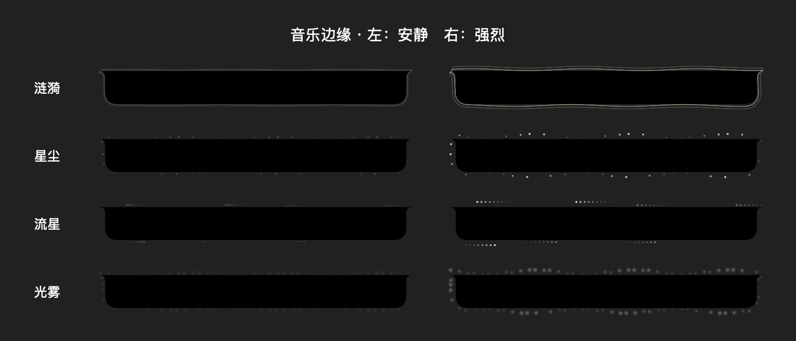

# Music perimeter effects — 2026-09-12

Implemented selectable ripple, dust, meteor and mist effects around the existing NotchShape, with gentle/standard/vivid intensity, local RMS audio response and four-period tint. Default is off. Settings: Media → 音乐边缘动效. The interior is masked so effects do not overlap lyrics. Pause fades out, track start fades in over two seconds and track ending uses the existing lyric dissolve envelope. Reduce Motion draws a static rim and disables audio capture.

Audio capture uses ScreenCaptureKit filtered to MusicManager's current player bundle identifier, consuming only audio buffers. No microphone capture, image output, recording or upload is added. Audio response requires system screen/system-audio capture permission. Silent/protected/unavailable audio falls back to gentle motion with a settings status. Toggle audio response or the effect off/on to reconnect. RMS reflects loudness, not semantic chorus recognition or precise beat detection. Actual Apple Music capture remains unverified until the user enables and authorizes the feature; synthetic tests do not establish protected-media compatibility.

Validation:
- Debug xcodebuild succeeded using /Applications/Xcode.app/Contents/Developer, derived data /tmp/interesting-notch-edge-build and existing /tmp/interesting-notch-baseline/SourcePackages. No new dependencies.
- Standalone scripts/MusicEdgeChecks.swift passed: RMS attack/release and invalid input; contour wrapping and finite geometry; four low/high rendered intensity differences; reduced-motion invariance.
- Inspected the rendered preview below. This is a synthetic preview of the production drawing view, not a screenshot of live audio capture.
- git diff --check passed. Ad-hoc signed product and installed bundle passed codesign --verify --deep --strict.
- Replaced /Users/zxy/Applications/InterestingNotch Development.app after quitting its prior process and restarted with -firstLaunch NO.



Reproduce pure checks from the worktree:

```sh
DEVELOPER_DIR=/Applications/Xcode.app/Contents/Developer xcrun swiftc -swift-version 5 -D EDGE_CHECKS boringNotch/managers/MusicEdgeAudio.swift boringNotch/components/Notch/NotchShape.swift boringNotch/components/Notch/MusicEdgeEffect.swift scripts/MusicEdgeChecks.swift -o /tmp/music-edge-checks
/tmp/music-edge-checks
```
