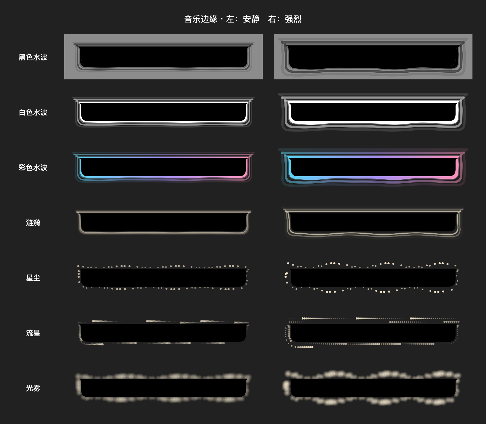

# Water palettes — 2026-09-12

Settings now group the existing black water under 水波, with a separate 水波颜色 picker: 黑色 / 白色 / 彩色. Existing `water` preferences still select black; new values `waterWhite` and `waterColor` share its geometry, phase speed and energy response. Color water uses a slowly rotating cyan/lavender/rose gradient. Reduced Motion keeps the palette and contour static. The center remains masked and black, preserving readable content.

Validation: full Debug xcodebuild succeeded; MusicEdgeChecks passed seven rendered styles, different palettes, transparent centers, intensity response and frozen reduced-motion palettes. Inspected the synthetic production-view preview below (not a live audio test). git diff --check passed. Ad-hoc signing verified and the stable installed application was replaced and restarted. Existing user style and strength preferences are preserved.

