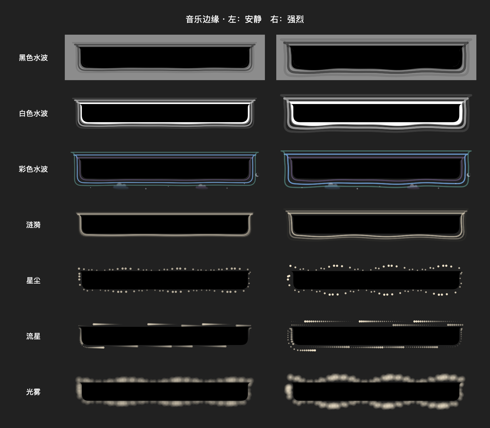

# Clouds, stars and crescent — 2026-09-12

Color water has two softly shaded drifting clouds, five sparse stars (two four-point highlights) and a small clipped crescent outside the right edge. Drift and twinkle are slow and continuous; presence responds gently to audio energy. Existing per-emission water colors are retained. Decorations use the outer content mask and the existing 24-point margin. They share playback/start/end opacity, pause behavior and skip rendering under Reduce Motion.

Added one color-water-only 云与星月 switch, stored as musicEdgeSky (default true), to retain access to the original pure colored waves. Other styles are not decorated. No dependencies or audio/network changes.

Validation: full Debug xcodebuild succeeded, MusicEdgeChecks passed with new sky-on/off render difference, black-water invariance and reduced-motion omission checks plus existing masks, palette and audio-envelope tests. git diff --check passed. Inspected synthetic production-view preview below, not live playback capture. Ad-hoc codesign verified and the stable installed application was replaced and restarted.

